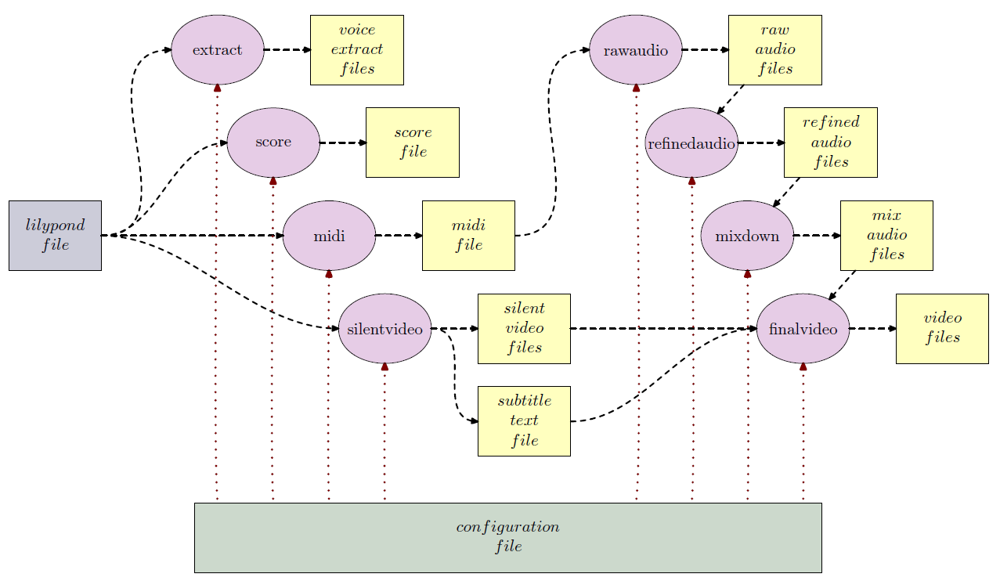

# LilypondToBandVideoConverter

## Introduction

The LilypondToBandVideoConverter is a python script that orchestrates
existing command line tools to convert a music piece written in the
lilypond notation to

- a *PDF score* of the whole piece,

- several *PDF voice extracts*,

- a *MIDI file with all voices* (with some preprocessing
  applied for humanization),

- *audio mix files* with several subsets of voices (specified
  by configuration), and

- *video files* for several output devices visualizing the
  score notation pages and having the mixes as mutually
  selectable audio tracks as backing tracks.

For processing a piece one must have

- a *lilypond fragment file* with the score information
  containing specific lilypond identifiers, and

- a *configuration file* giving details like the voices
  occuring in the piece, their associated midi instrument,
  target audio volume, list of mutable voices for the audio
  tracks etc.

Based on those files the python script -- together with some
open-source command-line software like ffmpeg or fluidsynth --
produces all the target files either incrementally or altogether.

The tool-chain has several processing phases that can be run as
required and produce the several outputs incrementally.  The following
figure shows the phases and their results and how the phases depend on
each other.

The files (in yellow) are generated by the phases (in magenta), the
configuration file (in green) and the lilypond fragment file (in blue)
are the only manual inputs into the processing chain.

Those phases are:

  - *extract:* generates PDF notation files for single voices as
    extracts (might use compacted versions if specified),

  - *score:* generates a single PDF file containing all voices as a
    score,

  - *midi:* generates a MIDI file containing all voices with specified
    instruments, pan positions and volumes,

  - *silentvideo:* generates (intermediate) silent videos containing
    the score pages for several output video file kinds (with
    configurable resolution and size),

  - *rawaudio:* generates unprocessed (intermediate) audio files for
    all the instrument voices from the midi tracks,

  - *refinedaudio:* generates (intermediate) audio files for all the
    instrument voices with additional audio processing applied,

  - *mix:* generates final compressed audio files with submixes of all
    instrument voices based on the refined audio files with a
    specified volume balance and some subsequent mastering audio
    processing (where the submix variants are configurable), and

  - *finalvideo:* generates a final video file with all submixes as
    selectable audio tracks and with a measure indication as subtitle

## Installation and Requirements

The script and its components are written in python and can be
installed as a single python package.  The package requires either
Python&nbsp;2.7 or Python&nbsp;3.3 or later.

Additionally the following software has to be available:

- *[lilypond][]*: for generating the score pdf, voice
   extract pdfs, the raw midi file and the score images used
   in the video files,

- *[ffmpeg][]*: for video generation and video
   postprocessing,

- *[fluidsynth][]*: for generation of voice audio files from
   a midi file plus some soundfont (e.g. [FluidR3_GM.sf3][]),

- *[sox][]*: for instrument-specific postprocessing of audio
   files for the target mix files as well as the mixdown,
   and

Optionally the following software is also used:

- *[qaac][]*: the AAC-encoder for the final audio mix file
   compression.

- *[mp4box][]*: the MP4 container packaging software

The location of all those commands as well as a few other
settings has to be defined in a global configuration file
for the LilypondToBandVideoConverter.

Installation is done from the PyPi repository via

    pip install lilypondToBandVideoConverter

Make sure that the scripts directory of python is in the path for
executables on your platform.

## Further Information

A longer description is available [here][notation-video] and the
detailed manual is available [here].

[ffmpeg]: http://ffmpeg.org/
[FluidR3_GM.sf3]: https://github.com/musescore/MuseScore/raw/2.1/share/sound/FluidR3Mono_GM.sf3
[fluidsynth]: http://www.fluidsynth.org/
[here]: http://www.tensi.eu/thomas/iPod/lilypondToBandVideoConverter.pdf
[lilypond]: http://lilypond.org/
[lilypondFileSyntax]: http://tensi.eu/thomas
[mp4box]: https://gpac.wp.imt.fr/mp4box/mp4box-documentation/
[notation-video]: http://www.tensi.eu/thomas/iPod/notation-video.html
[qaac]: https://sites.google.com/site/qaacpage/
[sox]: http://sox.sourceforge.net/
